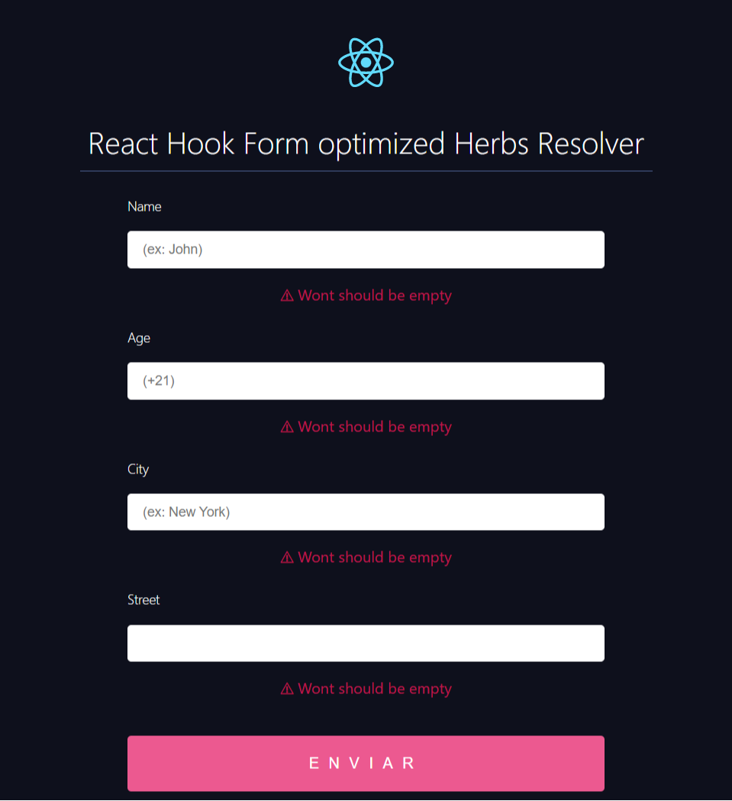

# Herbs React Hook Form
[](https://www.npmjs.com/package/herbs-react-hook-form) [](https://standardjs.com)


<p align="center">
  Create validation rules based on herbs entity with gotu and suma
</p>

<p align="center">
  
</p>

## Install

```bash
npm install --save herbs-react-hook-form
```

## Usage

Create an entity

```javascript
import { entity, field } from "@herbsjs/gotu"

export const User = entity('User', {
    name: field(String, {
        validation: {
            presence: true
        }
    }),
    age: field(String, {
        validation: {
            presence: true,
        }
    }),
    city: field(String, {
        validation: {
            presence: true
        }
    }),
    street: field(String, {
        validation: {
            presence: true
        }
    }),
})
```

Configure resolver to form instance

```jsx
import React, { Component } from 'react'
import { useForm } from "react-hook-form";
import { User } from "./domain/user";
import { herbsValidationResolver } from "herbs-react-hook-form"

function App() {

  const { register, handleSubmit, formState: { errors } } = useForm({
    mode: 'onChange',
    resolver: herbsValidationResolver(User)
  });

  const onSubmit = handleSubmit((data) => console.log(data));

  return (
    <div className="App">
      
      <div>
        <h1>React Hook Form optimized Herbs Resolver</h1>
        <form onSubmit={onSubmit}>
          <label>Name</label>
          <input {...register("name")} placeholder="(ex: John)" />
          {errors?.name && <p>{errors?.name?.message}</p>}

          <label>Age</label>
          <input {...register("age")} placeholder="(+21)" />
          {errors?.age && <p>{errors?.age?.message}</p>}

          <label>City</label>
          <input {...register("city")} placeholder="(ex: New York)" />
          {errors?.city && <p>{errors?.city?.message}</p>}

          <label>Street</label>
          <input {...register("street")} />
          {errors?.street && <p>{errors?.street?.message}</p>}

          <input type="submit" />
        </form>
      </div>
    </div>
  );
}
```

## Custom Messages

You can define a `suma2text` configuration to customize error messages

```javascript
{
  useDefault: 'ts-ME',
  languages: [
    {
      name: 'ts-ME',
      definitions: {
        types: [
          { key: 'Number', translation: 'Numeric' },
          { key: 'String', translation: 'Characters' }
        ],
        codes: [
          { key: 'cantBeEmpty', translation: 'Wont should be empty' },
          { key: 'wrongType', translation: 'Please the value correct is {0}' }
        ]
      }
    },
    {
      name: 'en-US',
      definitions: {
        types: [
          { key: 'Number', translation: 'Digit' },
          { key: 'String', translation: 'Char Array' }
        ],
        codes: [
          { key: 'cantBeEmpty', translation: 'Wont should be empty' },
          { key: 'wrongType', translation: 'The value correct is {0}' }
        ]
      }
    }
  ]
}
```

## License

MIT © [Maik Braga](https://github.com/Maik Braga)
